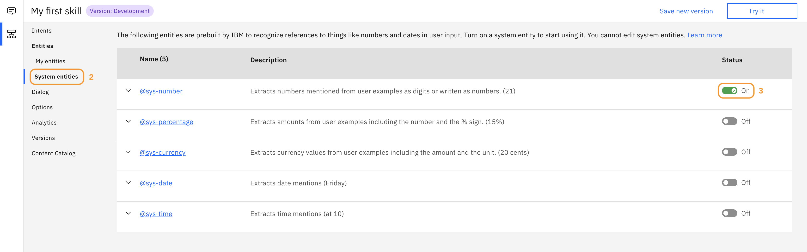
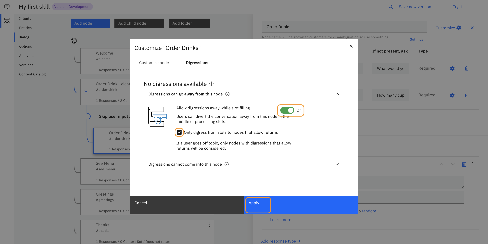

# How to build a virtual assistant with Watson
We will be creating an assistant to take coffee orders.

## Creating an IBM Cloud Account
1. Go to this link and create an account: https://ibm.biz/BdqYCy.
2. If you already have an account, go to the same [link](https://ibm.biz/BdqYCy) and click **Log in** on the top right of the page to continue.

## Provisioning a Watson Assistant instance
1. Once logged in, click on `Catalog` positioned on the right-hand side of the topbar.
2. Search for `Assistant`.
3. Under the `AI` Category, click on `Watson Assistant`.
4. Scroll down and make sure `Lite` Plan is selected for the free plan.
5. Click `Create`.
6. Click on `Launch Watson Assistant`.

## Creating Intents

Once in the tooling, click the `My first skill` tile to go to the `Skills` section.

1. Once in the `Skills` section, click `Create intent`.
2. Name the new intent `order-drink`.
3. Add a description of what the intent will do. For this, let's use "User wants to order a drink.".
4. Hit `Enter` to create the intent.
5. Start adding a few examples of how a user would order a drink (at least 5 examples are recommended). Click `Add example` to add a sample line. Let's use the following lines:

    - i would like to order a coffee please
    - I need some caffeine
    - order espresso
    - a cappuccino would be lovely
    - a latte please

6. Open the `Try it Out` panel by clicking on the speech bubble in the upper right corner. This allows you to test how your assistant will respond.
7. Wait for the assistant to finish training, then type `can I order a coffee`. It should classify the intent as `#order-drink`. Even though you didn't train the intent on this exact sentence, Watson can still understand it.

    Note that because we haven't trained the assistant yet on how to respond, the answer is still `I didn't understand. You can try rephrasing.`. This will change once we create the dialog.

8. Add a few more intents to make your assistant more robust. For this, click the  button, followed by the `Create Intent` button. Next, create the following intents and add a few examples to each:

    - #see-menu (User wants to see what's on the menu)
    - #greetings (User greets the assistant)
    - #thanks (User thanks the assistant)
  
    Below the output of the finished intents:

    

---
**Tip:** Instead of creating general intents like `greetings` and `thanks` yourself, you can also add a set of intents from the content catalog. For this, browse in the menu on the left-hand side to **Content Catalog**. You'll see some industry specific sets, but also a general one. Click on `Add to skill` to add a set to your skill.

---

## Creating Entities
1. In the menu on the lef-hand side, click on `Entities`.
2. Click `Create entity` and add the name `drink`. Press Enter to actually create the intent.
3. Turn `Fuzzy Matching` on if you want Watson to understand misspellings (should be on by default).
4. Add a value `coffee` with the synonym of `cafe`. Click `Add value` to actually add the new value with its synonym.
5. Complete this section by adding some additional values that you allow your users to order and any synonyms, for example:

    - espresso
    - cappuccino
    - latte
    - tea

6. Exit the page (1).

    

7. Click on `System entities` (2) underneath the `Entities` tab and turn on `@sys-number`.

    

    Here is how your finished entity `@drink` should look:

    

## Creating a Dialog
1. In the menu on the lef-hand side, click `Dialog`. This brings you to the dialog that was already part of the `My first skill` skill.
2. Click on the `Welcome` node if you would like to change the intro message.
3. Click `Add node`, and name it `Greetings`.
4. Add your `#greetings` intent as the field for `If assistant recognizes`.
5. Fill in a response that says something like "Hi! How can I help you today?".
6. Create two more nodes for the intents `#thanks` and `#see-menu` and add responses.
7. Create another node and name it `Order Drink`.
8. To the right of the name, click on `Customize`.
9. Turn on `Slots` and hit `Apply`.
10. Add the intent `#order-drink`to `If assistant recognizes`.
11. Under `Check for`, add the entity `@drink`.
12. Under `If not present, ask` add a question like "What would you like to drink?".
13. Click `Add slot`, and add a condition and prompt for `@sys-number`: "How many cups of $drink would you like?" (Note: the syntax `$variable` is short hand for accessing Context variables. Context variables allow you to pass information between your application and Watson Assistant).
14. Add in the response, "Ok, I have $number $drink coming right up!".

Below an example of the finished dialog tree with the `Order Drinks` node open:

**CONGRATULATIONS!!** :smiley: :+1: 

You successfully completed the lab!! Want to learn more? Try some of the following methods to bolster your CoffeeBot.
 
 

## [Optional] Resetting context
If your user orders a drink and completes the flow, and they try to make another order, the values found from the first flow will still be there so they will not be able to order something else. To fix this, we need to clear the context after a successful order so the values are not stored for the next order.

1. Create a node above the Slots node `Order Drinks` called `Order Drinks - Clear Context`.
2. Set the condition to `#order-drink`.
3. In the `Assistant responds` section, click on the three button menu on the right and click on `Open context editor`.
4. Fill in both variables (`drink` and `number`) and set the values to `null`.
5. Click on the three dot menu on the right side of original Slots node `Order Drinks`, and select `Move`. Then, click the new context clearing node and move to `As Child Node` (So, the parent node is the context clearing node, and the slots node is the child).
6. Go to the section called `Then assistant should` at the bottom of the context clearing node. Select `Skip user input`.
7. Try it out! Without clearing the try it out panel, order a drink. Once finished, try ordering another drink and it should prompt you for the two needed variables again. Here's what the finished context clearing node will look like:

    

## [Optional] Upgrading to Plus Trial
To make Web Chat appear, we'll need a Plus Trial account. You don't need a credit card for this and won't be charged. Find the `Try plus plan` button anywhere in the tooling, and click to find the button to `Try Plus Plan`. You find one when selecting your assistant. For this, click (1) to go the assistants section and click (2) to open your assistant. The `Try Plus Plan` button should be at the Search section at the bottom of the page.

## [Optional] Deploying Web Chat
Now that we have a functioning assistant, let's deploy it to a site to see how it will look for our coffee customers. If you have an existing page you'd like to embed, you can follow the steps below until we get to opening the sample HTML page. Otherwise, use the sample HTML page.
1. Make sure you're inside your assistant. Follow the steps (1) and (2) in the screenshot above to get to your assistant. By default your assistant is named `My first assistant`.
2. On the right side of the screen, click `Integrate Web Chat`.
3. Select Web Chat, and click `Create`.
4. We'll revisit the customization in a bit. For now, scroll down to the embed script titled `Add the chat UI to your web page` and leave this page open.
5. On the homepage of this repo, open the file `web-chat-example.html` in a new tab.
6. Open the `Raw` format of the file.
7. Save the page using `.html`.
8. Open this file in your computer's text editor (Note: for Mac, you have to Open the TextEdit app, choose File > Open, then select the document. Click Options at the bottom of the TextEdit dialog, then select “Ignore rich text commands.” Click Open.)
9. Back inside Watson Assistant, copy the embed script on the Web Chat page and paste over the section that says `INSERT EMBED SCRIPT HERE`.
8. Save the file.
9. Find the file in your downloads / desktop, and open it in your browser.
10. Start chatting with your bot!

### Customizing Web Chat
Back in the Web Chat configuration page within Watson Assistant, you can customize how Web Chat appears on your page. Try changing the accent color, adding your own title, or messing with the font. Make sure you select `Save changes` at the bottom, and refresh your mock coffee website.

## [Optional] Help - Digressions
Sometimes, you want an intent to be handled no matter where the user is in their flow. Think of Digressions as a global 'manage handlers': they allow you to respond to an intent even if a user is in the middle of a process flow, and then it allows them to return to their prior flow. If your user wants some help talking to the assistant anywhere in your assistant, this is a good intent to have digressions enabled.

1. Create a `#help` intent with examples like: "I need help".
2. Create a node below your `Order Drinks` node.
3. Add the condition of `#help` with a response like: "I can help you order a drink from my coffee shop. Just say order drink to get started!".
4. Go into the `Customize` portion of the node by clicking in the upper right.
5. Click on the `Digressions` tab.
6. Expand `Digressions can come into this node` and enable `Return after digression` (Digressions should be on by default, this setting allows you to handle the intent and then return back to the flow). Click `Apply` to complete this step.
7. Now to test this out, we need to get in the middle of our order drink flow. But first, since it is a slot, we need to go into the `Digressions` tab in the `Order Drinks` slots node.
8. Turn on `Allow digressions away while slot filling` and click the button that only allows nodes with returns enabled. This will help you to control which nodes you want to allow to digress to.

    

9. Try it out by saying "order drink", then when asked for what kind of drink you want, say "help". You should see a response from your help node with another follow up message for the next slot filling question.
